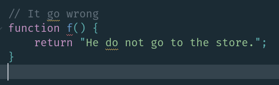
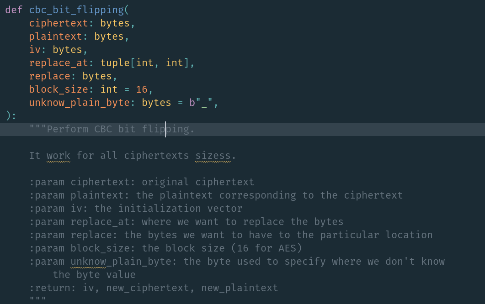

# Gramma
Grammar checker for sublime text.

Check the grammar in your strings / comments (or select the text if you want to manually check).




# Installation
Go to the directory `Packages`, in the configuration directory of sublime, and git clone this repo.

Install Language Tool
> docker pull erikvl87/languagetool

> docker run  --detach --restart always -it -p 8010:8010 erikvl87/languagetool

# Usage
Select the text you want to verify and press CTRL + G.

Or click on the line you want to verify and press CTRL + G.

# Keybinding

Key binding example,
```json
{ "keys": ["ctrl+g"], "command": "gramma"},
```

# Add words
This plugin load the same list used by the default spell checker, `added_words` and `ignored_words`.
So to add a word, do right click, "Add xxxxx" / "Ignore xxxxx" (this need a restart to reload the change).

# Ignored
To avoid false positive, some regex are used to clean to checked text
(to remove URLs, file paths, docstring parameters, code example starting with `>>> `, code example between ``` ` ```...)
